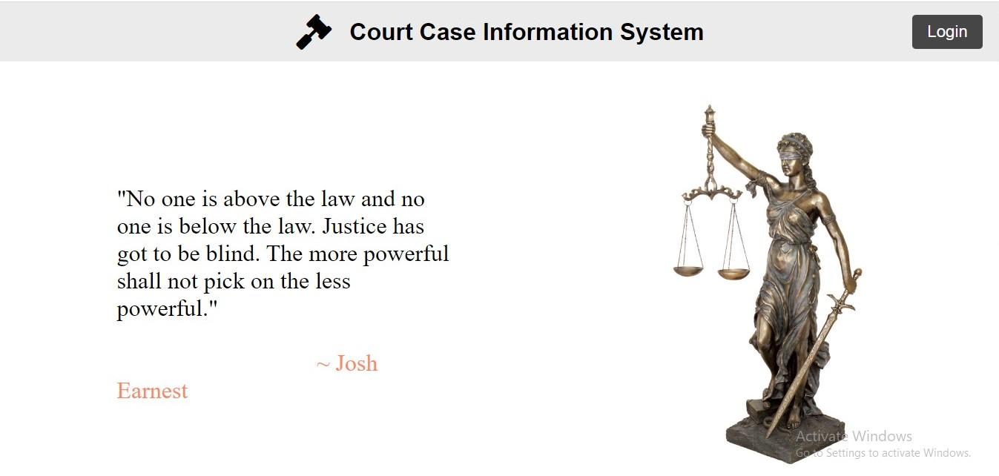

# Court-Case-Management-System
 A framework for computerizing the legal administrations in India. Utilizing this  framework, offended party can without much of a stretch offer grievance to the concerned expert  and they can see status of their cases and so forth. 

### All In One Court Management System

## Features:
### 1- Client Login - profile, add case, send feedback, current case info, notifications
### 2- Lawyer Login - profile, current cases, finished cases, mangae requests
### 5- Admin Panel - current cases, finished cases, manage lawyers, feedbacks

## How to Use this Repo

1- First Install Xampp.  
2- Start apache and mysql services.  
3- Download/Clone this repository in Xampp/htdocs or wamp64/www.  
4- Then open your http://localhost/phpmyadmin/ and create a new database by the name of  "court_case_management" and in top menu import the database file in the repository court_case_management.sql  
5- Enter this url http://localhost/Court-Case-Management-System/ on your browser to run it.  
6- Enjoy it!  
9- Don't forget to star it and keep promoting open source 😀
